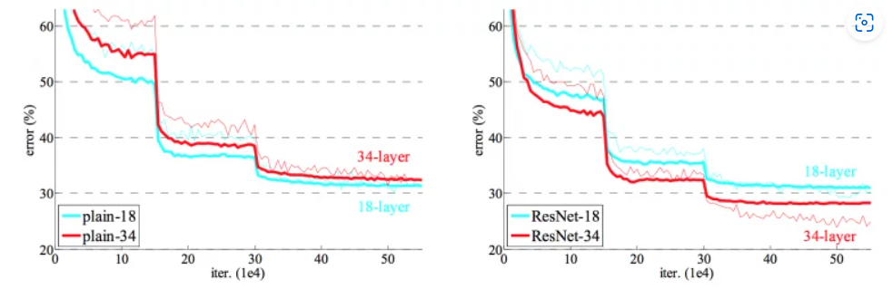
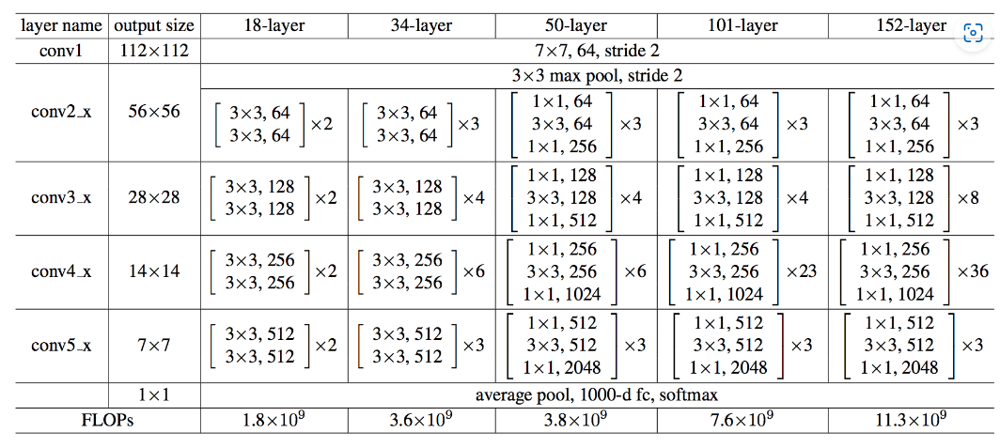

# ResNet34 on CIFAR-10

This repository contains the implementation of a **ResNet34** convolutional neural network (CNN) for image classification on the **CIFAR-10** dataset. The model is implemented using PyTorch, and training/testing has been done with the CIFAR-10 dataset, which consists of 10 classes of images.

# The General Prediction




## Table of Contents
- [Installation](https://pypi.org/project/cifar10/)
- [Usage](https://neurohive.io/en/popular-networks/resnet/)
- [Model Architecture](https://neurohive.io/en/popular-networks/resnet/)
- [Training](#training)
- [Evaluation](#evaluation)
- [Predicting on New Images](#predicting-on-new-images)
- [Results](#results)
- [References](#references)

## Installation

1. Clone this repository:
    ```bash
    git clone https://github.com/yourusername/resnet34_cifar10.git
    cd resnet34_cifar10
    ```

2. Install the required packages:
    ```bash
    pip install -r requirements.txt
    ```

3. Download the CIFAR-10 dataset during training, or you can manually download and place it in the `data` directory.

## Usage

### Training the Model

You can train the ResNet34 model on the CIFAR-10 dataset by running:

```bash
python train.py
```

### Predicting on new Images

You can visualize the prediction by running the script with an image file, and it will display the image with the predicted label.

```bash
python predict.py --image-path /path/to/your/image.png
```

### Model Architecture

The architecture used in this project is based on the ResNet34 model, a 34-layer deep residual network. It uses skip connections and batch normalization layers to avoid vanishing gradients during training. The key components of the model are:

BasicBlock: This forms the building block of the network.

ResNet: The main network class that stacks multiple layers of BasicBlock.
```bash
ResNet34(
  (conv1): Conv2d(3, 64, kernel_size=(7, 7), stride=(2, 2), padding=(3, 3), bias=False)
  (bn1): BatchNorm2d(64, eps=1e-05, momentum=0.1, affine=True, track_running_stats=True)
  (maxpool): MaxPool2d(kernel_size=3, stride=2, padding=1, dilation=1, ceil_mode=False)
  (layer1): Sequential(...)
  (layer2): Sequential(...)
  (layer3): Sequential(...)
  (layer4): Sequential(...)
  (avgpool): AdaptiveAvgPool2d(output_size=(1, 1))
  (fc): Linear(in_features=512, out_features=10, bias=True)
)
```
## the architecture in a tabular representation



## the outcomes will be ....


### Results 
```bash
Validation Loss : 0.8831 / ~21.57%

Validation Accuracy : 78.43%
```


### Acknowledgements

[**the ResNet Original Paper**](https://arxiv.org/pdf/1512.03385)

[**All you have to know about CIFAR10**](https://pypi.org/project/cifar10/)

